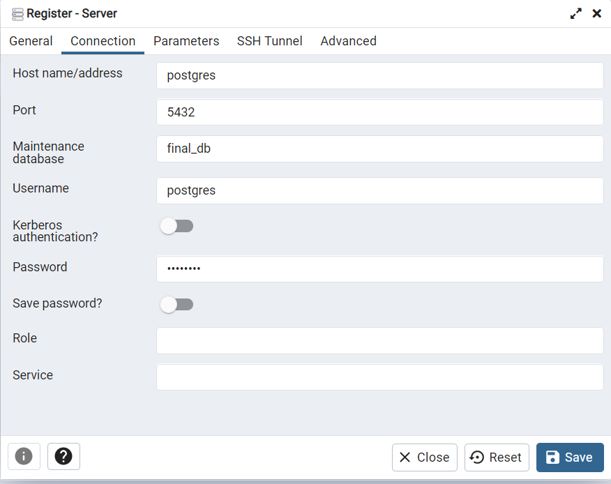

## Description

Fullstack application - online store of furniture.

Consists of 3 repositories - backend, client, admin.

## Links to repositories

[Backend application](https://github.com/borichevskiy/final-project-server.git)

[Client application](https://github.com/borichevskiy/final-project-frontend-client.git)

[Admin application](https://github.com/borichevskiy/final-project-frontend-admin.git)

---

## Running the app

```bash
$ docker-compose up --build
```

---

## Basic settings

After building the app, you have access to:

* pgAdmin is running on port 82

* client is running on port 8000

* admin is running on port 8001

* server is running on port 3000


Firstly you need to go to pgadmin and sign in: 

* email: admin@admin.com
* password: root


Then you need to register a server with

* the host - *postgres*  
* database - *final_db* 
* username - *postgres*  
* password - *postgres*



---

## Usage of application

Super admin is already exists in database. You can sign in with:

* email: *admin@admin.ru*
* password: *admin12345*

### Client

To be able to buy products, you need to register.


The following actions are available to you in your account:
* edit your personal information
* change password
* make orders
* chat GPT
* view cart


For admin available: 
* manipulate with products
* manipulate with categories
* assign roles on users
* manipulate with roles
* diactivate users
* edit your personal information
* change password


Default static is located on cloudinary service.

## Test

```bash
# unit tests
$ npm run test

# test coverage
$ npm run test:cov
```


## Authors

- [Irina Belyavskaya](https://github.com/Irina-Belyavskaya)
- [Alexey Borichevsky](https://github.com/borichevskiy)
- [Dmitry Vlasyuk](https://github.com/DmitryVlasyuk)
- [Regina Shushko](https://github.com/ReginaShushko)
